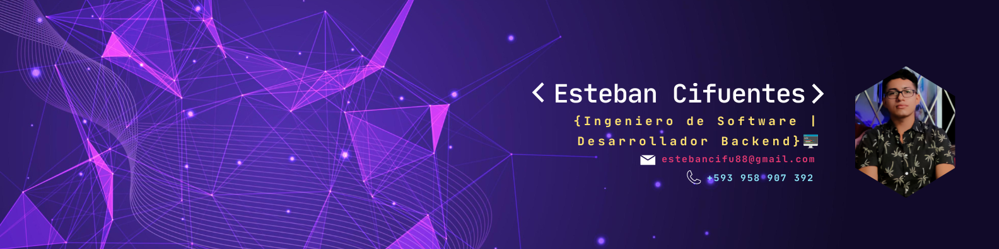

  

<h1 align="center">Soy Esteban Cifuentes, tu Ingeniero de Software de confianza</h1>

---

## 🚀 Sobre mí

Soy ingeniero de software, me dedico al desarrollo backend y disfruto mucho crear soluciones que hagan la vida más fácil a las personas. He trabajado con varios lenguajes como PHP, JavaScript, C#, Java y Python. Me considero una persona curiosa y con muchas ganas de aprender, siempre estoy buscando nuevos retos que me permitan crecer profesional y personalmente. Valoro mucho el trabajo en equipo, la comunicación y el aprendizaje compartido. Me adapto con rapidez, me gusta escuchar ideas, proponer soluciones y contribuir a un ambiente colaborativo.

---

## 🛠 Tecnologías

### 🧑‍💻 Lenguajes de programación

#### Frontend

  

#### Backend

  

---

### ⚙️ Frameworks

  

  

---

### 🛠️ Herramientas

  

  

---

### 🗄️ Bases de datos

  

  
  

---

### 🎨 Herramientas de diseño

  

  

---

### 🌐 Servidores web

  

  

---

## 📂 Proyectos Destacados

<table>
  <tr>
    <th>📌 Nombre</th>
    <th>📝 Descripción</th>
    <th>🧪 Tecnologías</th>
    <th>🔗 Repositorio</th>
  </tr>
  <tr>
    <td>Acroware</td>
    <td>
    Es una plataforma integral de gestión de activos que permite a las organizaciones administrar eficientemente diferentes activos. El sistema cuenta con funcionalidades avanzadas de gestión de usuarios, autenticación segura y notificaciones por correo electrónico automatizadas.
    </td>
    <td></td>
    <td><a href="https://github.com/Yachitzu/Acroware">Ver repositorio</a></td>
  </tr>
  <tr>
    <td>Cervecería INTI</td>
    <td>
      Es una plataforma web integral para la gestión de cervecerías que incluye una interfaz pública para clientes y una interfaz administrativa segura para operaciones CRUD.
    </td>
    <td></td>
    <td><a href="https://github.com/ChrisitanLP/ProyectoGestion6toSemestre">Ver repositorio</a></td>
  </tr>
  <tr>
    <td>Sistema de Gestión de Aprendizaje (LMS)</td>
    <td>
      Es una plataforma orientada a facilitar el proceso de enseñanza y aprendizaje dentro de la comunidad educativa. 
    </td>
    <td></td>
    <td><a href="https://github.com/ChrisitanLP/ProyectoFinalManejo">Ver repositorio</a></td>
  </tr>
</table>

---
## 🎓 Educación

<table>
  <tr>
    <td width="80">
      
    </td>
    <td>
      <strong>Universidad Técnica de Ambato</strong> 
      Ingeniero en Software 
      <em>2020 – 2025</em>
    </td>
  </tr>
</table>

---
## 🧾 Licencias y certificaciones

<table>
  <tr>
    <td width="80">
      
    </td>
    <td>
      <strong>Fundamentos de Python 2</strong> 
      Cisco Networking Academy – <em>jun. 2025</em> 
      Aptitudes: Python · Programación orientada a objetos (POO) · Estructuras de datos 
      <a href="./Archivos/Certificado_PY.pdf">📄 Ver certificado</a>
    </td>
  </tr>
  <tr>
    <td>
      
    </td>
    <td>
      <strong>Curso de introducción al desarrollo web: HTML y CSS (1/2)</strong> 
      Google Actívate – <em>may. 2025</em> 
      Aptitudes: HTML · Diseño web 
      <a href="https://skillshop.exceedlms.com/student/award/E7LHFjH86gCgkrJXWWiYxRnm">📄 Ver certificado</a>
    </td>
  </tr>
  <tr>
    <td>
      
    </td>
    <td>
      <strong>CSEI 2022 IV – Conference On Computer Science, Electronics And Industrial Engineering</strong> 
      Universidad Técnica de Ambato – <em>nov. 2022</em> 
      <a href="./Archivos/Curso_completo.pdf">📄 Ver certificado</a>
    </td>
  </tr>
  <tr>
    <td>
      
    </td>
    <td>
      <strong>Ensamblaje y mantenimiento de computadores</strong> 
      Universidad Técnica de Ambato – <em>jun. 2022</em> 
      Aptitudes: Ensamblaje de computadoras · Diagnóstico de fallas · Mantenimiento preventivo y correctivo · Instalación de sistemas operativos 
      <a href="./Archivos/Certificado_ensamblaje.pdf">📄 Ver certificado</a>
    </td>
  </tr>
</table>

---
## 📄 Descargar CV

  

## 📬 Puedes encontrame en:

  
  

    

---

## 📊 Estadísticas de GitHub

  

  

  

